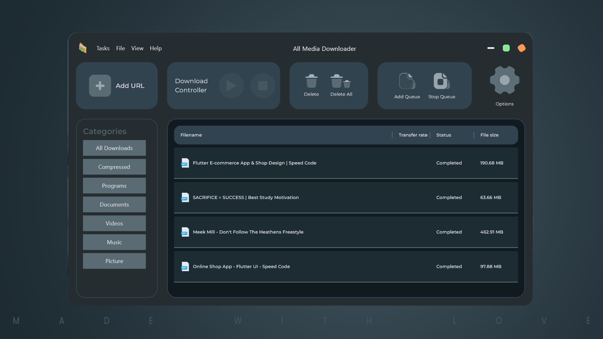

# ALL MEDIA DOWNLOADER
All Media Downloader is a convenient and powerful tool for downloading various types of media from social media platforms. With this Github project, users can easily download pictures, music, videos, and other types of media from popular social media websites like Facebook, Instagram, Twitter, and more.

The project is designed to be simple and intuitive, allowing users to quickly download media without any hassle. It provides a streamlined user interface that makes it easy to download the desired media, with options to download single or multiple files at once.

The All Media Downloader project is built on top of the APIs provided by social media platforms, ensuring that downloads are fast, reliable, and secure. It also includes features like progress bars, error handling, and pause/resume functionality to make the download process as smooth and seamless as possible.

Overall, All Media Downloader is an excellent choice for anyone looking for a fast, reliable, and convenient way to download media from social media platforms. Whether you're a social media manager, content creator, or just someone who wants to save media for personal use, this project is an essential tool for getting the job done.

## Features
- Download media from various social media platforms
- Support for downloading pictures, music, videos, and more
- Streamlined user interface for easy searching and selection of media
- Fast, reliable, and secure downloads using social media platform APIs
- Progress bars, error handling, and pause/resume functionality for a smooth download experience

